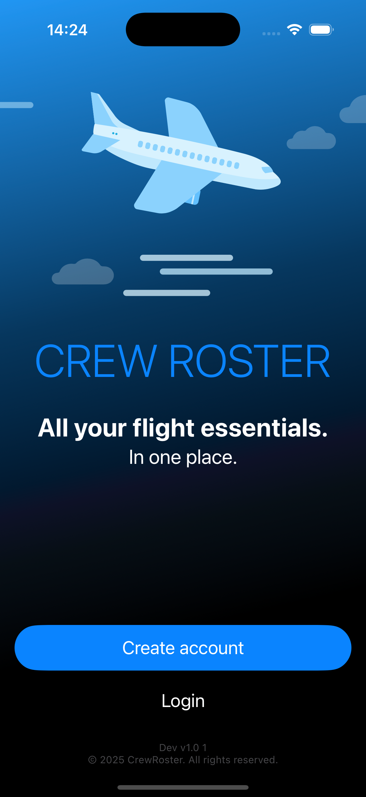
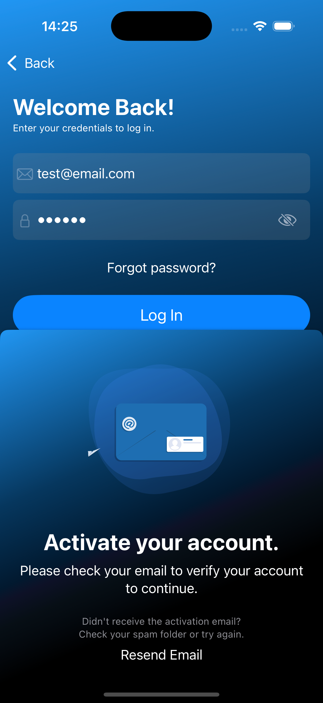
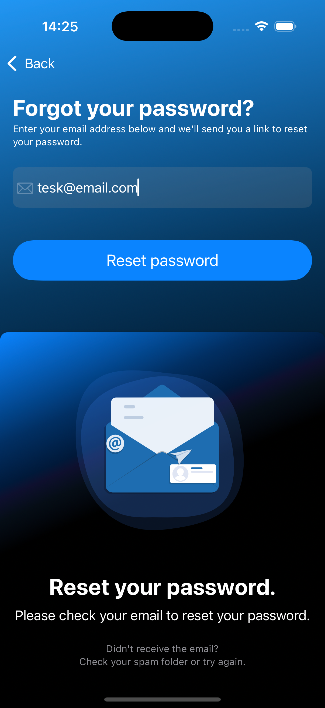

# ✈️ CrewRoster AuthDemo

This is a standalone version of the login component from my main iOS app, extracted to demonstrate architecture and flow without exposing sensitive or backend-related code.

---

## 📱 Screenshots

| Main | Register | Login | Reset password |
|------|----------|-------|----------------|
|  |  |  |  |

## 🧱 Project Structure

- `AuthDemo/` – App entry point
- `modules/Authentication` – Core logic implemented as a Swift Package

---

## ✅ Features

- Login and registration screens
- Basic local validation
- Error handling

---

## 🔧 Requirements

- iOS 17+
